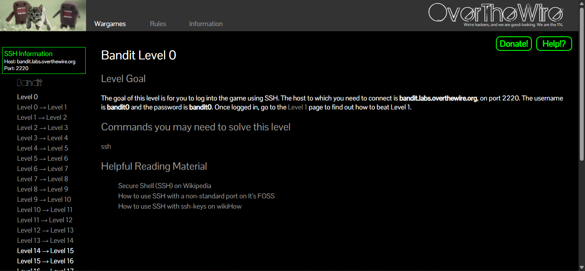
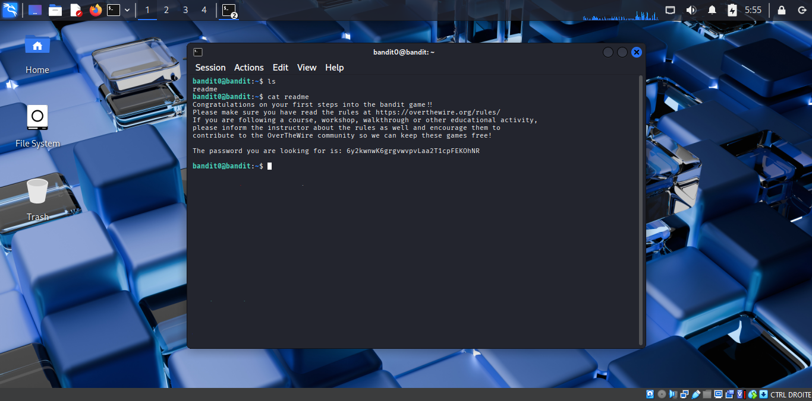
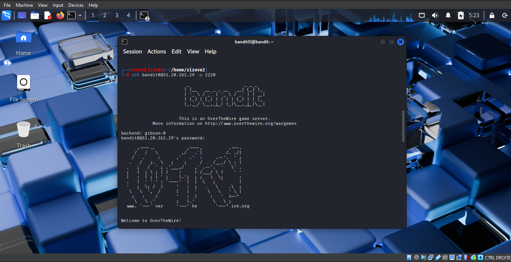

# Level 0 → 1

## Objective

Connect to the Bandit game server using SSH and retrieve the password for the next level.

---

## Given Credentials

The OverTheWire website provides the following information to connect:

- **Username:** `bandit0`
- **Password:** `bandit0`
- **Host:** `bandit.labs.overthewire.org`
- **Port:** `2220`



---

## Resolving the Hostname
# Level 0 → 1

## Objective

Retrieve the password for **Bandit Level 1** by locating and reading the file containing it.

---

## Understanding the Challenge

After successfully logging into **Bandit Level 0**, the next step is to find the password required to access **Bandit Level 1**.

> 💡 **Tip:** Create a local file to keep track of every password you discover throughout the Bandit wargame. This makes it easy to log back into previous levels whenever needed.

For example, I created a file named:

```text
theoverthewiredata.txt
```

I use this file to securely store each password as I progress through the challenges.

---

## Listing the Files

To view the contents of the current directory, I used the `ls` command.

```bash
ls
```

The output showed a file named:

```text
readme
```

---

## Reading the File

To display the contents of the `readme` file, I used the `cat` command.

```bash
cat readme
```

The command displayed the password required to access **Bandit Level 1**.

---

## Command Breakdown

### `ls`

Lists the files and directories in the current working directory.

```bash
ls
```

### `cat`

Displays the contents of a text file in the terminal.

```bash
cat readme
```

---

## Screenshots

### Listing the files and reading the password



### Local password notes

.png)
.png)
.png)
.png)

---

## What I Learned

- How to list files using the `ls` command.
- How to display the contents of a file using the `cat` command.
- The importance of keeping organized notes while working through cybersecurity labs.
- Basic Linux file navigation and file reading.

---

## Key Takeaway

Enumeration is one of the most important skills in Linux and cybersecurity. Before attempting anything complex, always inspect your environment, identify available files, and read any relevant information they contain.

---

## Password

The password for the next level is intentionally omitted to respect the learning experience and the spirit of the OverTheWire Bandit challenge.
Before connecting, I wanted to identify the IP address associated with the hostname.

I used the `nslookup` command:

```bash
nslookup bandit.labs.overthewire.org
```

The command resolved the hostname to the following IP address:

```text
51.20.162.29
```

> **Note:** Although SSH can connect directly using the hostname, I chose to use the IP address as a networking exercise to better understand how DNS resolves domain names.

---

## Connecting with SSH

Using the resolved IP address, I connected to the Bandit server with the following command:

```bash
ssh bandit0@51.20.162.29 -p 2220
```

When prompted, I entered the password:

```text
bandit0
```

After successful authentication, I was logged into the Bandit Level 0 Linux environment.



---

## Command Breakdown

### `nslookup`

Resolves a domain name (hostname) into its corresponding IP address.

```bash
nslookup bandit.labs.overthewire.org
```

### `ssh`

Establishes a secure, encrypted connection to a remote Linux server.

```bash
ssh bandit0@51.20.162.29 -p 2220
```

- `ssh` → Starts an SSH connection.
- `bandit0` → Username used to authenticate.
- `51.20.162.29` → Server IP address.
- `-p 2220` → Specifies the SSH port.

---

## What I Learned

- How to connect to a remote Linux server using SSH.
- The difference between a hostname and an IP address.
- How DNS resolves a hostname into an IP address.
- How to specify a custom SSH port using the `-p` option.
- The importance of SSH for secure remote administration.

---

## Key Takeaway

SSH is one of the most important tools in Linux and cybersecurity. It enables administrators and security professionals to securely access and manage remote systems. Understanding both hostname resolution and SSH connectivity is a fundamental networking skill.

---

## Password

The password for the next level is intentionally omitted to respect the learning experience and the spirit of the OverTheWire Bandit challenge.