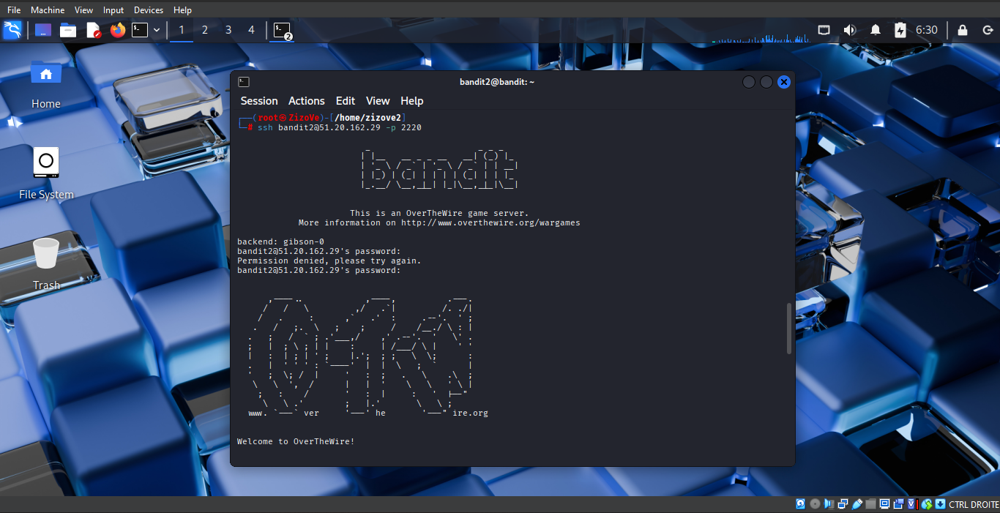
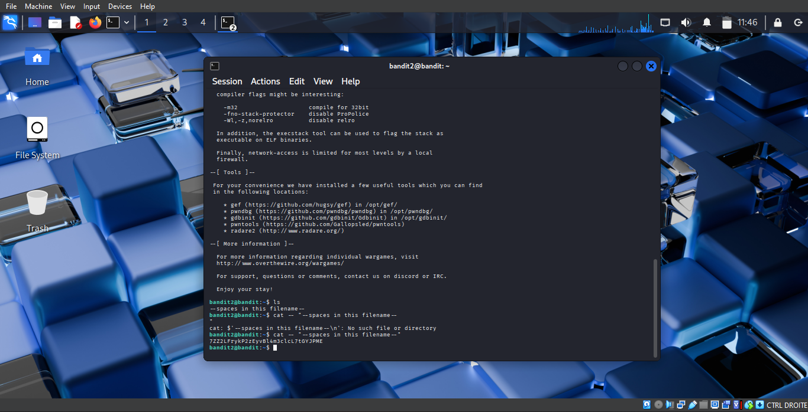

# Level 2 → 3

## Objective

Retrieve the password for **Bandit Level 3** by reading the contents of a file named:

```text
--spaces in this filename--
```

located in the current directory.

---

## Understanding the Challenge

After successfully completing **Bandit Level 1**, I logged into **Bandit Level 2** using the password obtained from the previous level.

```bash
ssh bandit2@bandit.labs.overthewire.org -p 2220
```

or, using the server's IP address:

```bash
ssh bandit2@51.20.162.29 -p 2220
```

After entering the password, I successfully accessed **Bandit Level 2**.

---

## Enumerating the Directory

The first step was to inspect the contents of the current directory.

I used the `ls` command:

```bash
ls
```

The output showed a file named:

```text
--spaces in this filename--
```

Unlike previous levels, this filename contains both **spaces** and **leading dashes (`--`)**, which require special handling.

---

## Reading the File

A normal command such as:

```bash
cat --spaces in this filename--
```

will **not work** because:

- The spaces cause Linux to interpret the filename as multiple arguments.
- The leading `--` is interpreted as a command-line option instead of part of the filename.

To tell `cat` that the following text is a filename rather than an option, I used:

```bash
cat -- "--spaces in this filename--"
```

### Why does this work?

- `--` tells the command that **all following arguments are filenames**, not command options.
- `" "` keeps the entire filename together as a single argument, even though it contains spaces.

The command successfully displayed the password required to access **Bandit Level 3**.

---

## Command Breakdown

### `ssh`

Connects securely to the remote Bandit server.

```bash
ssh bandit2@51.20.162.29 -p 2220
```

### `ls`

Lists the files and directories in the current directory.

```bash
ls
```

### `cat`

Displays the contents of a text file.

```bash
cat -- "--spaces in this filename--"
```

---

## Screenshots

### Logging into Bandit Level 2



### Listing the file and retrieving the password



---

## What I Learned

- How to log into the next Bandit level using the password from the previous challenge.
- How Linux interprets filenames containing spaces.
- Why quotation marks (`" "`) are required when a filename contains spaces.
- Why `--` is used to indicate the end of command options.
- How to safely access files whose names begin with special characters.

---

## Key Takeaway

Linux commands often interpret special characters such as spaces and dashes in specific ways. Understanding how to escape or protect filenames using quotation marks and the `--` option is an essential skill for working with the Linux command line and solving cybersecurity challenges.

---

## Password

The password for the next level is intentionally omitted to respect the learning experience and the spirit of the OverTheWire Bandit challenge.